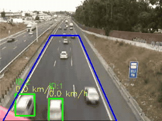

# Highway Vehicle Counting and Speed Estimation


Detecting, tracking and counting vehicles travelling on one carriageway of a motorway, from a fixed traffic camera, and estimating each vehicle's speed. Uses background subtraction and centroid tracking in OpenCV.



> Academic project - Image Processing and Vision (*Processamento de Imagem e Visão*), BSc in Computer Science and Multimedia Engineering (LEIM), ISEL. 

---

## Process

### 1. Background Estimation

The camera is fixed, so the road itself is whatever stays constant. The background is built by averaging up to $300$ frames sampled every 3rd frame. Moving vehicles pass through any given pixel briefly and average out, leaving an empty road. 

### 2. Region of Interest

Analysis is restricted to a four-point polygon covering a single carriageway, `[100,70] [155,70] [230,240] [5,240]`. Everything outside is masked away, so the opposite carriageway and the roadside never enter the pipeline.

### 3. Detection

Per frame: a $21×21$ Gaussian blur, absolute difference against the background, conversion to grayscale, masking to the ROI, then **Otsu** thresholding, which picks its own threshold per frame instead of a fixed constant.

The binary result is cleaned with a $7×7$ elliptical `CLOSE` (twice) to seal gaps inside a vehicle, then an `OPEN` to remove speckle. External contours become bounding boxes, kept only if their area is between $800$ and $10,000$ px and their aspect ratio between $0.3$ and $3$.

### 4. Tracking and Speed

Each detection's centroid is matched against the previous frame's centroids: if one lies within $30$ px horizontally and $40$ px vertically, it is the same vehicle and keeps its ID; otherwise a new ID is issued. Speed comes from the centroid displacement between consecutive frames, converted with a fixed scale of $0.15$ m/px and the video's frame rate, then smoothed over the last $3$ measurements. Vehicles that vanish are dropped from the tracking state.

## Results

The pipeline runs end to end and produces the annotated video above. Vehicles are segmented from the background, bounded, given stable IDs while they remain in view, and labelled with a speed estimate.

The count it reports is **not reliable**. Three concrete causes, visible in the demo:

- **Near-field bias.** Detection fires only in the lower part of the ROI. Perspective makes a car at the top of the trapezoid a handful of pixels across, well under the $800$ px minimum area, so it is discarded until it comes close.
- **Identity churn.** Because a vehicle is only detected intermittently, it drops out of the tracking state and is re-issued a new ID when it reappears. The reported total counts identities, not vehicles, so intermittent detection inflates it.
- **Exaggerated speeds.** The $0.15$ m/px factor is a single constant applied to the whole ROI, but under perspective a pixel near the bottom of the frame covers far less road than one near the top. Combined with centroid jitter between frames, the estimates come out high. 

Full analysis in [`docs/P2A_52D_A51589_A51811.pdf`](docs/P2A_52D_A51589_A51811.pdf).

## Repository structure

```
.
├── docs/
│   ├── demo.gif                        
│   ├── P2A_52D_A51589_A51811.pdf       # project report (PT)
│   └── T2A1sem2526_enunciado.pdf       # assignment brief (PT)
├── src/
│   ├── main.ipynb                      # pipeline
│   ├── cars_counted_speed.mp4          # output video
│   └── resources/
│       └── AutoEstrada.avi             # source footage
├── requirements.txt
└── README.md
```

| Function | Purpose |
| :-- | :-- |
| `background` | Averages sampled frames into a static background image |
| `detect` | Background difference, Otsu threshold, morphology and contour filtering for one frame |
| `calc_speed` | Converts centroid displacement between frames into km/h |
| `count` | Detection, ID assignment, speed smoothing, annotation, output |

## Authors

Group project for Image Processing and Vision (T52D), ISEL - DEI, 2025/26. Supervised by Prof. João Pedro Costa and Prof. Pedro Mendes Jorge.

- Ricardo Faria (51589)
- Bruno Pereira (51811)
